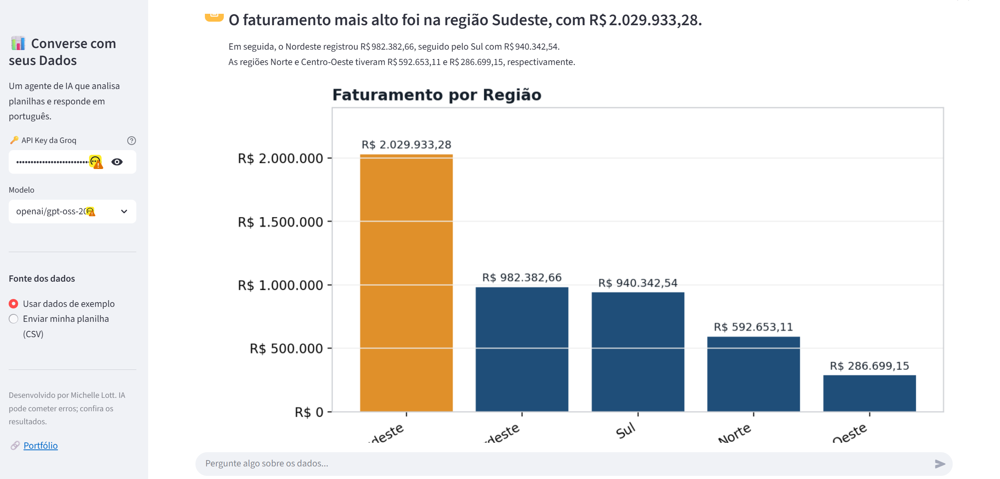

# Converse com seus Dados - Agente Analista de Dados

Um agente de IA que analisa planilhas e responde perguntas em português, com
texto e gráfico. Você sobe um CSV (ou usa a base de exemplo), pergunta em
linguagem natural ("quais os 5 produtos que mais faturaram?", "mostre a
tendência mensal", "quantas vendas ficaram abaixo da meta por estado?") e o
agente responde na hora.

**Sou analista de dados, então construí uma IA que faz análise de dados.**

## 🎬 Demonstração

<!-- ARRASTE AQUI um GIF ou vídeo da aplicação rodando (screenshot.png também serve). -->



## 🧠 Como funciona (arquitetura do agente)

O agente trabalha em três passos, um padrão clássico de agentes (planejar,
agir, observar):

1. **Planejar** - o LLM (via Groq) recebe a pergunta e o esquema da tabela e
   devolve um **plano de análise estruturado em JSON** (qual operação, colunas,
   agregação, filtro e tipo de gráfico).
2. **Executar** - o app roda esse plano com **pandas**, usando apenas operações
   pré-definidas e confiáveis.
3. **Explicar** - o LLM lê o resultado calculado e escreve o **insight em
   linguagem natural**.

> **Decisão de segurança:** o agente nunca executa código gerado pela IA. Em vez
> disso, o LLM só escolhe uma operação de uma lista segura, e o cálculo é feito
> por código Python confiável. Isso evita execução de código arbitrário, um
> risco comum em agentes que rodam o que o modelo escreve.

## 🛠️ Ferramentas

Python · Streamlit · Groq (LLM) · pandas · matplotlib

## ▶️ Como rodar localmente

1. Clone o repositório e entre na pasta.
2. Instale as dependências:
   ```bash
   pip install -r requirements.txt
   ```
3. Pegue uma chave de API gratuita da Groq em https://console.groq.com/keys
4. Rode a aplicação:
   ```bash
   streamlit run app.py
   ```
5. Cole a chave na barra lateral e comece a perguntar.

## ☁️ Publicar online (grátis)

Dá para hospedar de graça no **Streamlit Community Cloud**:
1. Suba este repositório no GitHub.
2. Em https://share.streamlit.io, conecte o repositório e aponte para `app.py`.
3. Pronto: você recebe um link público do app rodando ao vivo.

## 📂 Arquivos

- `app.py` - interface (Streamlit)
- `agente.py` - o cérebro do agente (chamadas ao LLM: planejar e explicar)
- `analise.py` - o motor de análise seguro (executa os planos com pandas)
- `dados_exemplo.csv` - base de vendas fictícia para testar sem upload

## 📝 Observação

Os dados de exemplo são fictícios, gerados apenas para demonstração. A IA pode
cometer erros; confira sempre os resultados.
